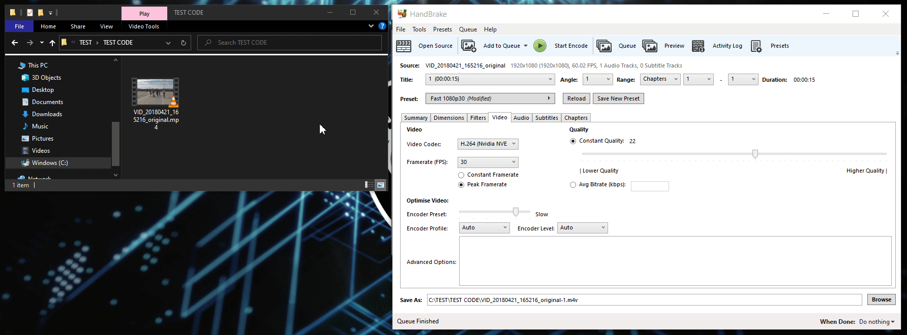
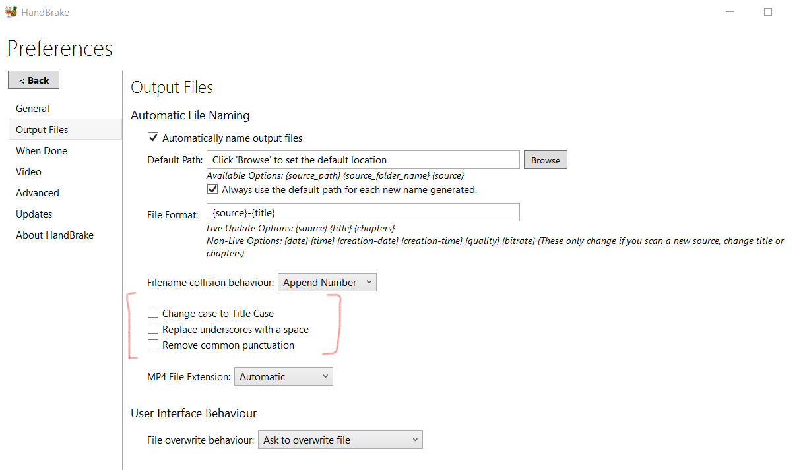

# Why this app ?

I have made this software because I personally use Handbrake to compress my videos before putting them on my cloud storage and unfortunately, Handbrake do not copy the useful metadata added by my phone (location, date of capture …) Using the software ffmpeg in command line with my huge gallery did not feel right, now using this software I can copy the meta from all my compressed video in a folder at once. Hopefully, it will help somebody else.

Make sure to disable the few aumatically checked boxes from the handBrake preferences:
- Change case to Title Case 		-> uncheck
- Replace underscores with space 	-> uncheck
- Remove common punctuation			-> uncheck

# OS available

Tested on:
 - Windows 10 build 19042
 - Ubuntu 20.04 LTS

## Available Scripts

In the project directory, you can run:

## Requirement

In the project directory, you can run:

### `npm run startR`

Run React in DEV mode.
Accesible at [http://localhost:3000](http://localhost:3000) to view it in the browser.

The page will reload if you make edits.
You will also see any lint errors in the console.

### `npm run startE`

Will open the electron window in PROD (will try to start the page from the last build of react).

### `npm run ed`

Will start a electron window in DEV mode.

### `npm run startAll`

Will start the react server, then will wait till localhost:3000 is ready to finaly start the electron window.

### `recommended way to start coding`

First start react server by typing `npm run startR`
Then in a separate terminal tab run `npm run ed` (which will open the electron window in DEV mode)
At this point you are ready to code, all your changes will be reflected in live in your electron window, if ever you change something on the electron side, you can simply quit the process in your terminal tab rendering ed (electron DEV) and restart it.

### Create executable

Use the command `npm run build` to create the build version of react. Then `npm run make` to create the package for your plateform (`.exe` on windows or `.deb` and `.rpm` on Ubuntu). You can also create the .exe on Windows and `.deb` and `.rpm` using WSL.

See the section about [deployment](https://facebook.github.io/create-react-app/docs/deployment) for more information.